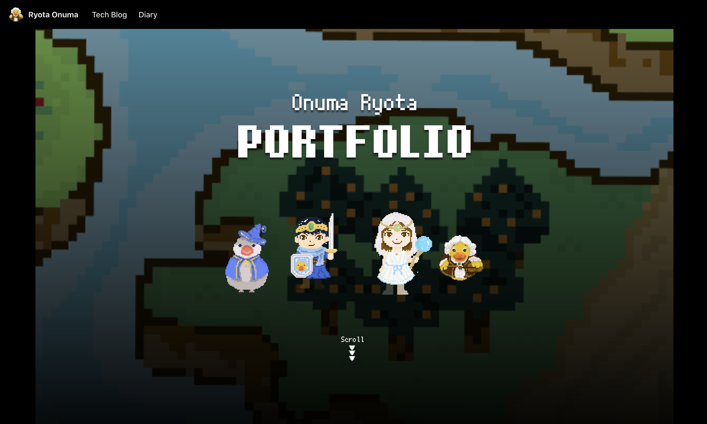

新年の節目に、、ポートフォリオサイトを[Docusaurus](https://docusaurus.io/)で作り直しました。

<!-- truncate -->

## 使用技術について

[Docusaurus](https://docusaurus.io/)を採用しました。Docusaurusは、OSSドキュメントサイトを簡単に作成できるフレームワークで、Meta社が主導してオープンソースで開発されています。また、機能的にはブログの構築にも使えます。

Docusaurusを採用した理由は以下です。

- 多言語対応が容易
- Docusaurusプロジェクトをinitした時点で、技術ブログに必要な機能が揃っている
  - マークダウン記法での執筆がデフォルトでサポートされている
  - コードのシンタックスハイライトが標準機能として含まれている
  - デフォルトのデザインが洗練されている
- カスタムページの作成も、Reactベースで簡単に拡張可能

これまで、Hugo、Gatsby、SvelteKit、Next.js、Nuxt.jsといったさまざまなフレームワークを使って類似のポートフォリオサイトを構築してきました。しかし、Docusaurusが最も効率的に構築でき、メンテナンスの手間も少ないと感じています。

特に、レスポンシブ対応やマークダウン to HTML周りのCSSを自分で書く必要がない点は、長期的な運用において非常に魅力的です。

今後は、このサイトを活用してさまざまなコンテンツを投稿していこうと思います。

