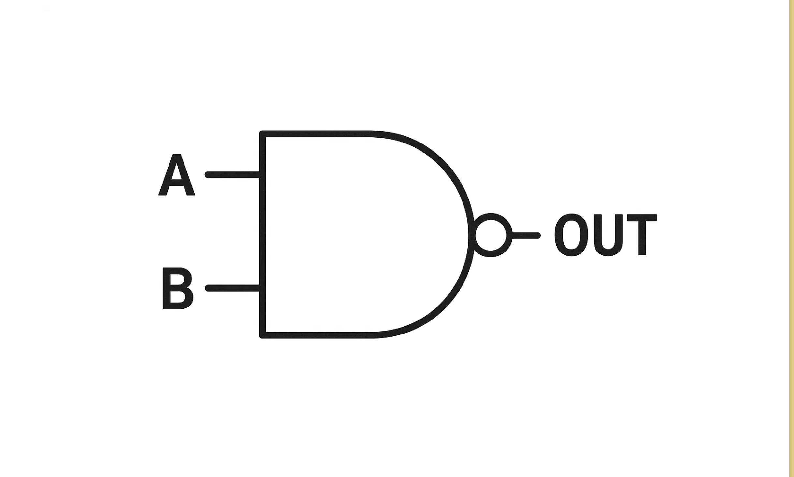

# 論理ゲート

Nand2Tetrisの第1章をやる。この章は与えられたNandゲートを拡張し、他の様々な論理ゲートを作っていくというもの。

## Nandゲート



Built-Inのものを使用するが、Nandゲートがどういう動作をするかだけ確認しておく。
AとBという入力ピンを備えたNandゲートに0/1入力を加えた場合、どのようなアウトプットになるかを示した票が以下である。

| A | B | Out|
| ---- | ---- | ---- |
| 0 | 0 | 1 |
| 1 | 0 | 1 |
| 0 | 1 | 1 |
| 1 | 1 | 0 |

Nandゲートの結果は、Andゲートの結果をNotゲートで反転させたものと一致する。


## Notゲート

NotゲートのHDLは以下である。NandゲートはAとBの入力が同じだったら、Outはその入力の反対がでてくるので、それを利用する。

```hdl
// This file is part of www.nand2tetris.org
// and the book "The Elements of Computing Systems"
// by Nisan and Schocken, MIT Press.
// File name: projects/1/Not.hdl
/**
 * Not gate:
 * if (in) out = 0, else out = 1
 */
CHIP Not {
    IN in;
    OUT out;

    PARTS:
    Nand(a= in, b= in, out= out);
}
```

表にまとめると以下。

| In | Out|
| ---- | --- |
| 0 | 1 |
| 1 | 0 |


## Andゲート

Nandゲートの説明時にも言及したように、NandゲートはAndゲートのアウトプットをNotゲートで反転させたものであるから、Andゲートを作りたかったらNandゲートとNotゲートを組み合わせれば良い。

Andゲートは以下のように、AとBという入力が両方1ならばOutに1を出力し、そうじゃない場合は0を出力するというもの。

| A | B | Out|
| ---- | ---- | ---- |
| 0 | 0 | 0 |
| 1 | 0 | 0 |
| 0 | 1 | 0 |
| 1 | 1 | 1 |


HDLは以下である。

```hdl
// This file is part of www.nand2tetris.org
// and the book "The Elements of Computing Systems"
// by Nisan and Schocken, MIT Press.
// File name: projects/1/And.hdl
/**
 * And gate:
 * if (a and b) out = 1, else out = 0 
 */
CHIP And {
    IN a, b;
    OUT out;
    
    PARTS:
    Nand(a= a, b= b, out= toNot);
    Not(in=toNot, out=out);
}
```

## Orゲート

Orゲートは、AとBの入力のどちらかが少なくとも1ならば、Outが1になるというもの。AとBの両方が0のときのみ、Outは0になる。

| A | B | Out|
| ---- | ---- | ---- |
| 0 | 0 | 0 |
| 1 | 0 | 1 |
| 0 | 1 | 1 |
| 1 | 1 | 1 |


HDLは以下である。

```
// This file is part of www.nand2tetris.org
// and the book "The Elements of Computing Systems"
// by Nisan and Schocken, MIT Press.
// File name: projects/1/Or.hdl
/**
 * Or gate:
 * if (a or b) out = 1, else out = 0 
 */
CHIP Or {
    IN a, b;
    OUT out;

    PARTS:
    Nand(a=a,b=a,out= first);
    Nand(a=b,b=b,out=second);
    Nand(a=first,b=second,out=out);
}
```


## Xorゲート

Xor(Exclusive-or)ゲートは、AとBへの入力値が異なるならばOutを1とし、AとBへの入力値が同じならばOutを0にするというもの。
表にすると以下である。

| A | B | Out|
| ---- | ---- | ---- |
| 0 | 0 | 0 |
| 1 | 0 | 1 |
| 0 | 1 | 1 |
| 1 | 1 | 0 |

`if ((a and Not(b)) or (Not(a) and b)) out = 1, else out = 0` これを愚直に表現すれば良さそう。

HDLにすると以下である。

```
// This file is part of www.nand2tetris.org
// and the book "The Elements of Computing Systems"
// by Nisan and Schocken, MIT Press.
// File name: projects/1/Xor.hdl
/**
 * Exclusive-or gate:
 * if ((a and Not(b)) or (Not(a) and b)) out = 1, else out = 0
 */
CHIP Xor {
    IN a, b;
    OUT out;

    PARTS:
    Not(in=b,out=notB);
    And(a=a,b=notB,out=first);
    Not(in=a,out=notA);
    And(a=notA,b=b,out=second);
    Or(a=first,b=second,out=out);
}
```

## Muxゲート

Muxゲート（マルチプレクサ）では、AとBという入力の他に、selという選択ピンが与えられる。selの入力が0なら、Aへの入力値がMuxゲートのOutとして出力される。selの入力が1なら、Bへの入力値がMuxゲートのOutとして出力される。

| A | B | sel | Out |
| ---- | ---- | ---- |---- |
| 0 | 0 | 0 | 0 |
| 0 | 1 | 0 | 0 |
| 1 | 0 | 0 | 1 |
| 1 | 1 | 0 | 1 |
| 0 | 0 | 1 | 0 |
| 1 | 0 | 1 | 0 |
| 0 | 1 | 1 | 1 |
| 1 | 1 | 1 | 1 |

HDLにすると以下である。


```hdl
// This file is part of www.nand2tetris.org
// and the book "The Elements of Computing Systems"
// by Nisan and Schocken, MIT Press.
// File name: projects/1/Mux.hdl
/** 
 * Multiplexor:
 * if (sel = 0) out = a, else out = b
 */
CHIP Mux {
    IN a, b, sel;
    OUT out;

    PARTS:
    Not(in=sel,out=notSel);
    And(a=a,b=notSel,out=tmpA);
    And(a=b,b=sel,out=tmpB);
    Or(a=tmpA,b=tmpB,out=out);
}
```

## Dmuxゲート

Dmuxゲート(デマルチプレクサ)はinとselを入力値として受け取る。selの値が0だったらinをAから出力し、Bからは0を出力する。selの値が1だったらBから出力し、Aからは0を出力する。


| in | sel | A | B |
| ---- | ---- | ---- |---- |
| 0 | 0 | 0 | 0 |
| 1 | 0 | 1 | 0 |
| 0 | 1 | 0 | 0 |
| 1 | 1 | 0 | 1 |


Aへの出力はselの値を反転させ、inとのAnd演算をした結果となる。Bへの出力の計算においては、そのままselとinでAnd演算すればOK。Bが1になるのは、inとselが両方1になるとき。


```hdl
// This file is part of www.nand2tetris.org
// and the book "The Elements of Computing Systems"
// by Nisan and Schocken, MIT Press.
// File name: projects/1/DMux.hdl
/**
 * Demultiplexor:
 * [a, b] = [in, 0] if sel = 0
 *          [0, in] if sel = 1
 * selが0だったらinはa selが1だったらinはb
 */
CHIP DMux {
    IN in, sel;
    OUT a, b;

    PARTS:
    Not(in=sel,out=notSel);
    And(a=in,b=notSel,out=a);
    And(a=in,b=sel,out=b);
}
```

## Not16ゲート

16bitの入力のそれぞれにNot演算を適用し、16bitの結果として返すだけ。


```
// This file is part of www.nand2tetris.org
// and the book "The Elements of Computing Systems"
// by Nisan and Schocken, MIT Press.
// File name: projects/01/Not16.hdl
/**
 * 16-bit Not gate:
 * for i = 0, ..., 15:
 * out[i] = Not(a[i])
 */
CHIP Not16 {
    IN in[16];
    OUT out[16];

    PARTS:
    Not(in=in[0], out=out[0]);
    Not(in=in[1], out=out[1]);
    Not(in=in[2], out=out[2]);
    Not(in=in[3], out=out[3]);
    Not(in=in[4], out=out[4]);
    Not(in=in[5], out=out[5]);
    Not(in=in[6], out=out[6]);
    Not(in=in[7], out=out[7]);
    Not(in=in[8], out=out[8]);
    Not(in=in[9], out=out[9]);
    Not(in=in[10], out=out[10]);
    Not(in=in[11], out=out[11]);
    Not(in=in[12], out=out[12]);
    Not(in=in[13], out=out[13]);
    Not(in=in[14], out=out[14]);
    Not(in=in[15], out=out[15]);
}
```

## And16ゲート

16bitの入力のそれぞれにAnd演算を適用し、16bitの結果として返すだけ。

```hdl
// This file is part of www.nand2tetris.org
// and the book "The Elements of Computing Systems"
// by Nisan and Schocken, MIT Press.
// File name: projects/1/And16.hdl
/**
 * 16-bit And gate:
 * for i = 0, ..., 15:
 * out[i] = a[i] And b[i] 
 */
CHIP And16 {
    IN a[16], b[16];
    OUT out[16];

    PARTS:
    And(a=a[0], b=b[0], out=out[0]);
    And(a=a[1], b=b[1], out=out[1]);
    And(a=a[2], b=b[2], out=out[2]);
    And(a=a[3], b=b[3], out=out[3]);
    And(a=a[4], b=b[4], out=out[4]);
    And(a=a[5], b=b[5], out=out[5]);
    And(a=a[6], b=b[6], out=out[6]);
    And(a=a[7], b=b[7], out=out[7]);
    And(a=a[8], b=b[8], out=out[8]);
    And(a=a[9], b=b[9], out=out[9]);
    And(a=a[10], b=b[10], out=out[10]);
    And(a=a[11], b=b[11], out=out[11]);
    And(a=a[12], b=b[12], out=out[12]);
    And(a=a[13], b=b[13], out=out[13]);
    And(a=a[14], b=b[14], out=out[14]);
    And(a=a[15], b=b[15], out=out[15]);
}
```


## Or16ゲート

16bitの入力のそれぞれにOr演算を適用し、16bitの結果として返すだけ。

```hdl
// This file is part of www.nand2tetris.org
// and the book "The Elements of Computing Systems"
// by Nisan and Schocken, MIT Press.
// File name: projects/1/Or16.hdl
/**
 * 16-bit Or gate:
 * for i = 0, ..., 15:
 * out[i] = a[i] Or b[i] 
 */
CHIP Or16 {
    IN a[16], b[16];
    OUT out[16];

    PARTS:
    Or(a=a[0], b=b[0], out=out[0]);
    Or(a=a[1], b=b[1], out=out[1]);
    Or(a=a[2], b=b[2], out=out[2]);
    Or(a=a[3], b=b[3], out=out[3]);
    Or(a=a[4], b=b[4], out=out[4]);
    Or(a=a[5], b=b[5], out=out[5]);
    Or(a=a[6], b=b[6], out=out[6]);
    Or(a=a[7], b=b[7], out=out[7]);
    Or(a=a[8], b=b[8], out=out[8]);
    Or(a=a[9], b=b[9], out=out[9]);
    Or(a=a[10], b=b[10], out=out[10]);
    Or(a=a[11], b=b[11], out=out[11]);
    Or(a=a[12], b=b[12], out=out[12]);
    Or(a=a[13], b=b[13], out=out[13]);
    Or(a=a[14], b=b[14], out=out[14]);
    Or(a=a[15], b=b[15], out=out[15]);
}
```


## Mux16ゲート

16bitの入力のそれぞれのbitとselピンの入力をMuxゲートにかけ、16bitの結果として返すだけ。

```
// This file is part of www.nand2tetris.org
// and the book "The Elements of Computing Systems"
// by Nisan and Schocken, MIT Press.
// File name: projects/1/Mux16.hdl
/**
 * 16-bit multiplexor: 
 * for i = 0, ..., 15:
 * if (sel = 0) out[i] = a[i], else out[i] = b[i]
 */
CHIP Mux16 {
    IN a[16], b[16], sel;
    OUT out[16];

    PARTS:
    Mux(a=a[0], b=b[0], sel=sel, out=out[0]);
    Mux(a=a[1], b=b[1], sel=sel, out=out[1]);
    Mux(a=a[2], b=b[2], sel=sel, out=out[2]);
    Mux(a=a[3], b=b[3], sel=sel, out=out[3]);
    Mux(a=a[4], b=b[4], sel=sel, out=out[4]);
    Mux(a=a[5], b=b[5], sel=sel, out=out[5]);
    Mux(a=a[6], b=b[6], sel=sel, out=out[6]);
    Mux(a=a[7], b=b[7], sel=sel, out=out[7]);
    Mux(a=a[8], b=b[8], sel=sel, out=out[8]);
    Mux(a=a[9], b=b[9], sel=sel, out=out[9]);
    Mux(a=a[10], b=b[10], sel=sel, out=out[10]);
    Mux(a=a[11], b=b[11], sel=sel, out=out[11]);
    Mux(a=a[12], b=b[12], sel=sel, out=out[12]);
    Mux(a=a[13], b=b[13], sel=sel, out=out[13]);
    Mux(a=a[14], b=b[14], sel=sel, out=out[14]);
    Mux(a=a[15], b=b[15], sel=sel, out=out[15]);
}
```


## Or8Wayゲート

8bitの入力のうち、1bitでも1の入力があれば、Or8WayゲートのOutは1になる。そうじゃないなら0になる。
Orゲートは2bitずつしか検証できないので、内部pinを駆使しつつピラミッド式にすべての入力にOr演算を適用する。

```hdl
// This file is part of www.nand2tetris.org
// and the book "The Elements of Computing Systems"
// by Nisan and Schocken, MIT Press.
// File name: projects/1/Or8Way.hdl
/**
 * 8-way Or gate: 
 * out = in[0] Or in[1] Or ... Or in[7]
 */
CHIP Or8Way {
    IN in[8];
    OUT out;

    PARTS:
    Or(a=in[0] , b=in[1] , out=tmp1);
    Or(a=in[2] , b=in[3] , out=tmp2);
    Or(a=in[4] , b=in[5] , out=tmp3);
    Or(a=in[6] , b=in[7] , out=tmp4);
    Or(a=tmp1 , b=tmp2 , out=tmp5);
    Or(a=tmp3 , b=tmp4 , out=tmp6);
    Or(a=tmp5 , b=tmp6 , out=out);
}
```

## Mux4Way16ゲート

4つの16bitの入力と、2bitのselの入力が与えられるマルチプレクサ。2bitの値次第で、16bitの出力としてどの入力値を適用するかが決まる。

```hdl
// This file is part of www.nand2tetris.org
// and the book "The Elements of Computing Systems"
// by Nisan and Schocken, MIT Press.
// File name: projects/1/Mux4Way16.hdl
/**
 * 4-way 16-bit multiplexor:
 * out = a if sel = 00
 *       b if sel = 01
 *       c if sel = 10
 *       d if sel = 11
 */
CHIP Mux4Way16 {
    IN a[16], b[16], c[16], d[16], sel[2];
    OUT out[16];
    
    PARTS:
    Mux16(a=a, b=b, sel=sel[0], out=tmp);
    Mux16(a=c, b=d, sel=sel[0], out=tmp2);
    Mux16(a=tmp , b=tmp2, sel=sel[1], out=out);
}
```

## Mux8Way16ゲート

Mux4Way16ゲートの入力とselのbit数が増えたもの。
selの最初の2bitをみつつMux4Way16ゲートにかける　* 2セット →　得られた結果をMux16ゲートにかけると、outが得られる。

```hdl
// This file is part of www.nand2tetris.org
// and the book "The Elements of Computing Systems"
// by Nisan and Schocken, MIT Press.
// File name: projects/1/Mux8Way16.hdl
/**
 * 8-way 16-bit multiplexor:
 * out = a if sel = 000
 *       b if sel = 001
 *       c if sel = 010
 *       d if sel = 011
 *       e if sel = 100
 *       f if sel = 101
 *       g if sel = 110
 *       h if sel = 111
 */
CHIP Mux8Way16 {
    IN a[16], b[16], c[16], d[16],
       e[16], f[16], g[16], h[16],
       sel[3];
    OUT out[16];

    PARTS:
    Mux4Way16(a=a , b=b , c=c , d=d , sel=sel[0..1] , out=tmp);
    Mux4Way16(a=e , b=f , c=g , d=h , sel=sel[0..1] , out=tmp2);
    Mux16(a=tmp , b=tmp2 , sel=sel[2] , out= out);
}
```

## DMux4Wayゲート

4通りの出力先、および切り替えのための2bitのselが与えられることが特徴のデマルチプレクサ。
selの後半の1bitをつかって出力先を絞り込む　→　selの前半の1bitを使って出力先を絞り込む

```
// This file is part of www.nand2tetris.org
// and the book "The Elements of Computing Systems"
// by Nisan and Schocken, MIT Press.
// File name: projects/1/DMux4Way.hdl
/**
 * 4-way demultiplexor:
 * [a, b, c, d] = [in, 0, 0, 0] if sel = 00
 *                [0, in, 0, 0] if sel = 01
 *                [0, 0, in, 0] if sel = 10
 *                [0, 0, 0, in] if sel = 11
 */
CHIP DMux4Way {
    IN in, sel[2];
    OUT a, b, c, d;

    PARTS:
    DMux(in=in, sel=sel[1], a=tmp, b=tmp2); 
    DMux(in=tmp, sel=sel[0], a=a, b=b);
    DMux(in=tmp2, sel=sel[0], a=c, b=d);
}
```

## DMux8Wayゲート

8通りの出力先、および切り替えのための3bitのselが与えられることが特徴のデマルチプレクサ。
DMux4Wayを使ってinを4通りのtmpのどれかに振り分け、4通りそれぞれをDMuxにかけることで、８つの出力先のどのbitにinを振り分けるかを決められる。

```hdl
// This file is part of www.nand2tetris.org
// and the book "The Elements of Computing Systems"
// by Nisan and Schocken, MIT Press.
// File name: projects/1/DMux8Way.hdl
/**
 * 8-way demultiplexor:
 * [a, b, c, d, e, f, g, h] = [in, 0,  0,  0,  0,  0,  0,  0] if sel = 000
 *                            [0, in,  0,  0,  0,  0,  0,  0] if sel = 001
 *                            [0,  0, in,  0,  0,  0,  0,  0] if sel = 010
 *                            [0,  0,  0, in,  0,  0,  0,  0] if sel = 011
 *                            [0,  0,  0,  0, in,  0,  0,  0] if sel = 100
 *                            [0,  0,  0,  0,  0, in,  0,  0] if sel = 101
 *                            [0,  0,  0,  0,  0,  0, in,  0] if sel = 110
 *                            [0,  0,  0,  0,  0,  0,  0, in] if sel = 111
 */
CHIP DMux8Way {
    IN in, sel[3];
    OUT a, b, c, d, e, f, g, h;

    PARTS:
    DMux4Way(in=in , sel=sel[0..1], a=tmp, b=tmp2 , c=tmp3 , d=tmp4);
    DMux(in=tmp,sel=sel[2], a=a , b=e);
    DMux(in=tmp2,sel=sel[2], a=b , b=f);
    DMux(in=tmp3,sel=sel[2], a=c , b=g);
    DMux(in=tmp4,sel=sel[2], a=d , b=h);
}
```

