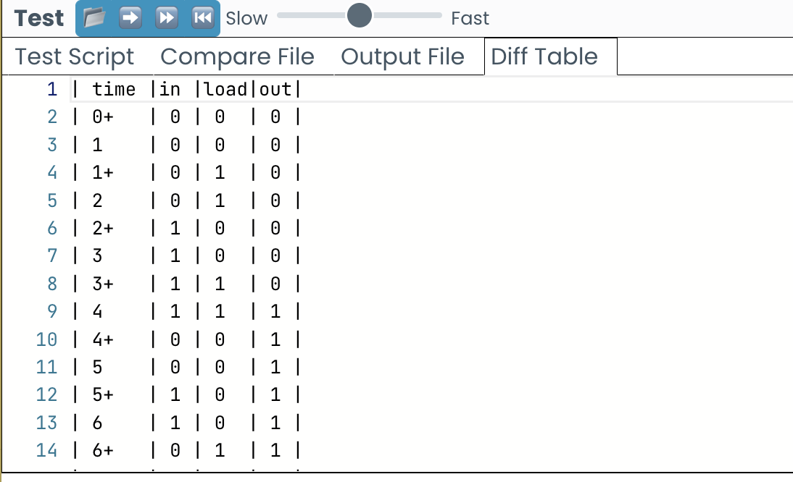

# メモリ


Nand2Tetrisの第3章をやる。この章はDフリップフロップからレジスタ、RAMを作るというもの。

## Dフリップフロップ

Nand2TetrisではBuiltInのDフリップフロップを使用するが、その動作原理について整理しておく。

これまで第1章と第2章で構築してきたチップは「組み合わせ回路」と呼ばれるもので、時間の概念を持たない非同期回路である。これらは、入力が変われば即座に出力が決定される(クロック非依存)。

それに対し、Dフリップフロップは「状態」を保持できるため、時間の概念を持つ「順序回路」（同期回路）を構成するための基本構成要素となる。
Dフリップフロップの動作は以下のように要約できる：

出力 out(t) は、1クロック前の入力 in(t-1) に等しくなる(out(t) = in(t-1))

つまり、Dフリップフロップはクロックの立ち上がり（または立ち下がり）時に入力を記憶し、次のクロックまでその値を保持する

これにより、計算の「途中経過」や「状態」を記録することが可能になる

このような性質を利用して、レジスタやメモリ、カウンタなど、より高度なコンピュータ構成要素を構築できるようになる。


## 1Bitレジスタ

loadの1bit入力が0のときは、次のクロックの出力は、今のクロックの出力と同じになる。loadの入力が1のときは、inの入力が次のクロックの出力になる。つまり値が更新される。
これにより、loadが0である限り、値を保持しつづけることになる。



これは、MuxゲートとDフリップフロップゲートを組み合わせることで実現できる。

```hdl
// This file is part of www.nand2tetris.org
// and the book "The Elements of Computing Systems"
// by Nisan and Schocken, MIT Press.
// File name: projects/3/a/Bit.hdl
/**
 * 1-bit register:
 * If load is asserted, the register's value is set to in;
 * Otherwise, the register maintains its current value:
 * if (load(t)) out(t+1) = in(t), else out(t+1) = out(t)
 */
CHIP Bit {
    IN in, load;
    OUT out;

    PARTS:
    Mux(a=dffout,b=in,sel=load,out=muxOut);
    DFF(in=muxOut,out=out,out=dffout);
}
```

## 16Bitレジスタ

入力と出力が16ビットになるだけで、できることは1Bitレジスタと同じ。

```hdl
// This file is part of www.nand2tetris.org
// and the book "The Elements of Computing Systems"
// by Nisan and Schocken, MIT Press.
// File name: projects/3/a/Register.hdl
/**
 * 16-bit register:
 * If load is asserted, the register's value is set to in;
 * Otherwise, the register maintains its current value:
 * if (load(t)) out(t+1) = in(t), else out(t+1) = out(t)
 */
CHIP Register {
    IN in[16], load;
    OUT out[16];

    PARTS:
    Bit(in=in[0] , load=load, out=out[0]);
    Bit(in=in[1] , load=load, out=out[1]);
    Bit(in=in[2] , load=load, out=out[2]);
    Bit(in=in[3] , load=load, out=out[3]);
    Bit(in=in[4] , load=load, out=out[4]);
    Bit(in=in[5] , load=load, out=out[5]);
    Bit(in=in[6] , load=load, out=out[6]);
    Bit(in=in[7] , load=load, out=out[7]);
    Bit(in=in[8] , load=load, out=out[8]);
    Bit(in=in[9] , load=load, out=out[9]);
    Bit(in=in[10], load=load, out=out[10]);
    Bit(in=in[11], load=load, out=out[11]);
    Bit(in=in[12], load=load, out=out[12]);
    Bit(in=in[13], load=load, out=out[13]);
    Bit(in=in[14], load=load, out=out[14]);
    Bit(in=in[15], load=load, out=out[15]);
}
```

## RAM8

16Bitレジスタを8つ組み合わせて、RAM8チップを作る。
指定したaddressに対応するDMux8Wayのoutのみがloadの値を引き継ぎ、他のDMux8Wayのoutは0になる。つまり、loadが1だった場合、addressに対応する1つのRegisterのみが更新される。

最後に、各Registerのoutを一挙に受け入れているMux8Way16に対してaddressを渡すことで、更新対象のRegisterからのoutのみを抽出し、RAM8のoutとすることができる。

```hdl
// This file is part of www.nand2tetris.org
// and the book "The Elements of Computing Systems"
// by Nisan and Schocken, MIT Press.
// File name: projects/03/a/RAM8.hdl

/**
 * Memory of 8 registers, each 16 bit-wide. Out holds the value
 * stored at the memory location specified by address. If load=1, then 
 * the in value is loaded into the memory location specified by address 
 * (the loaded value will be emitted to out after the next time step.)
 */

CHIP RAM8 {
    IN in[16], load, address[3];
    OUT out[16];

    PARTS:
    // 指定したaddressに対応するoutだけ、loadと同じ値になる。それ以外は問答無用で0になる
    DMux8Way(in=load,sel=address,a=a,b=b,c=c,d=d,e=e,f=f,g=g,h=h);

    // addressで指定されていないRegisterは、ずっとloadは0なので更新されない
    // addressで指定されているRegisterは、loadが入力値に対応するため更新される可能性がある
    Register(in=in,load=a,out=oa);
    Register(in=in,load=b,out=ob);
    Register(in=in,load=c,out=oc);
    Register(in=in,load=d,out=od);
    Register(in=in,load=e,out=oe);
    Register(in=in,load=f,out=of);
    Register(in=in,load=g,out=og);
    Register(in=in,load=h,out=oh);

    // addressに対応した16bitレジスタの値が、読み取りのために出力される
    Mux8Way16(a=oa,b=ob,c=oc,d=od,e=oe,f=of,g=og,h=oh,sel=address,out=out);
}
```

## RAM64

RAM8チップを8つ組み合わせて、RAM64チップを作る。やっていることはRAM8チップと同じ。ただし、addressが6bitになっており、前半の3bitはどのRAM8チップを使うかの特定に使用し、後半の3bitはどのRegisterを使うかの特定に使用する。

```hdl
// This file is part of www.nand2tetris.org
// and the book "The Elements of Computing Systems"
// by Nisan and Schocken, MIT Press.
// File name: projects/3/a/RAM64.hdl
/**
 * Memory of sixty four 16-bit registers.
 * If load is asserted, the value of the register selected by
 * address is set to in; Otherwise, the value does not change.
 * The value of the selected register is emitted by out.
 */
CHIP RAM64 {
    IN in[16], load, address[6];
    OUT out[16];

    PARTS:
    DMux8Way(in=load,sel=address[0..2],a=a,b=b,c=c,d=d,e=e,f=f,g=g,h=h);
    RAM8(in=in, load=a, address=address[3..5], out=ra);
    RAM8(in=in, load=b, address=address[3..5], out=rb);
    RAM8(in=in, load=c, address=address[3..5], out=rc);
    RAM8(in=in, load=d, address=address[3..5], out=rd);
    RAM8(in=in, load=e, address=address[3..5], out=re);
    RAM8(in=in, load=f, address=address[3..5], out=rf);
    RAM8(in=in, load=g, address=address[3..5], out=rg);
    RAM8(in=in, load=h, address=address[3..5], out=rh);
    Mux8Way16(a=ra , b=rb , c=rc , d=rd , e=re , f=rf , g=rg , h=rh , sel=address[0..2], out=out);
}
```


## RAM512

RAM64チップを8つ組み合わせて、RAM512チップを作る。やっていることはRAM64チップと同じ。ただし、addressが9bitになっており、前半の3bitはどのRAM64チップを使うかの特定に使用し、後半の6bitはRAM64内でどのRAM8チップやどのRegisterを使うかを特定するために使われる。


```hdl
// This file is part of www.nand2tetris.org
// and the book "The Elements of Computing Systems"
// by Nisan and Schocken, MIT Press.
// File name: projects/3/b/RAM512.hdl
/**
 * Memory of 512 16-bit registers.
 * If load is asserted, the value of the register selected by
 * address is set to in; Otherwise, the value does not change.
 * The value of the selected register is emitted by out.
 */
CHIP RAM512 {
    IN in[16], load, address[9];
    OUT out[16];

    PARTS:
    DMux8Way(in=load,sel=address[0..2],a=a,b=b,c=c,d=d,e=e,f=f,g=g,h=h);
    RAM64(in=in, load=a, address=address[3..8], out=ra);
    RAM64(in=in, load=b, address=address[3..8], out=rb);
    RAM64(in=in, load=c, address=address[3..8], out=rc);
    RAM64(in=in, load=d, address=address[3..8], out=rd);
    RAM64(in=in, load=e, address=address[3..8], out=re);
    RAM64(in=in, load=f, address=address[3..8], out=rf);
    RAM64(in=in, load=g, address=address[3..8], out=rg);
    RAM64(in=in, load=h, address=address[3..8], out=rh);
    Mux8Way16(a=ra , b=rb , c=rc , d=rd , e=re , f=rf , g=rg , h=rh , sel=address[0..2], out=out);
}
```


## RAM4K

RAM512と同じ理屈。

```hdl
// This file is part of www.nand2tetris.org
// and the book "The Elements of Computing Systems"
// by Nisan and Schocken, MIT Press.
// File name: projects/3/b/RAM4K.hdl
/**
 * Memory of 4K 16-bit registers.
 * If load is asserted, the value of the register selected by
 * address is set to in; Otherwise, the value does not change.
 * The value of the selected register is emitted by out.
 */
CHIP RAM4K {
    IN in[16], load, address[12];
    OUT out[16];

    PARTS:
    DMux8Way(in=load,sel=address[0..2],a=a,b=b,c=c,d=d,e=e,f=f,g=g,h=h);
    RAM512(in=in, load=a, address=address[3..11], out=ra);
    RAM512(in=in, load=b, address=address[3..11], out=rb);
    RAM512(in=in, load=c, address=address[3..11], out=rc);
    RAM512(in=in, load=d, address=address[3..11], out=rd);
    RAM512(in=in, load=e, address=address[3..11], out=re);
    RAM512(in=in, load=f, address=address[3..11], out=rf);
    RAM512(in=in, load=g, address=address[3..11], out=rg);
    RAM512(in=in, load=h, address=address[3..11], out=rh);
    Mux8Way16(a=ra , b=rb , c=rc , d=rd , e=re , f=rf , g=rg , h=rh , sel=address[0..2], out=out);
}
```


## RAM16K

RAM4Kを4つ組み合わせて、RAM16Kチップを作る。これまでのRAMと同様の原理で、addressが14bitになっており、前半の2bitはどのRAM4Kチップを使うかの特定に使用し、後半の12bitはRAM4K内でどのRAM512チップやどのRegisterを使うかを特定するために使われる。

```hdl
// This file is part of www.nand2tetris.org
// and the book "The Elements of Computing Systems"
// by Nisan and Schocken, MIT Press.
// File name: projects/3/b/RAM16K.hdl
/**
 * Memory of 16K 16-bit registers.
 * If load is asserted, the value of the register selected by
 * address is set to in; Otherwise, the value does not change.
 * The value of the selected register is emitted by out.
 */
CHIP RAM16K {
    IN in[16], load, address[14];
    OUT out[16];

    PARTS:
    DMux4Way(in=load,sel=address[0..1],a=a,b=b,c=c,d=d);
    RAM4K(in=in, load=a, address=address[2..13], out=ra);
    RAM4K(in=in, load=b, address=address[2..13], out=rb);
    RAM4K(in=in, load=c, address=address[2..13], out=rc);
    RAM4K(in=in, load=d, address=address[2..13], out=rd);
    Mux4Way16(a=ra , b=rb , c=rc , d=rd, sel=address[0..1], out=out);
}
```

