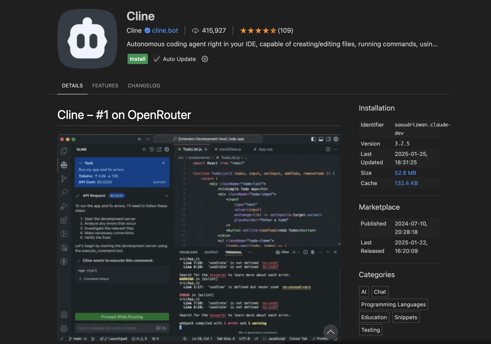
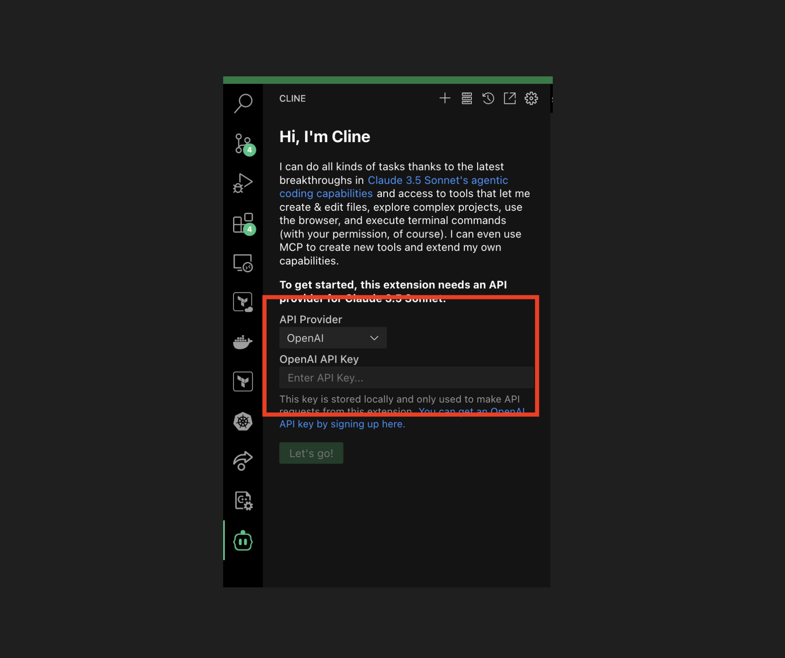
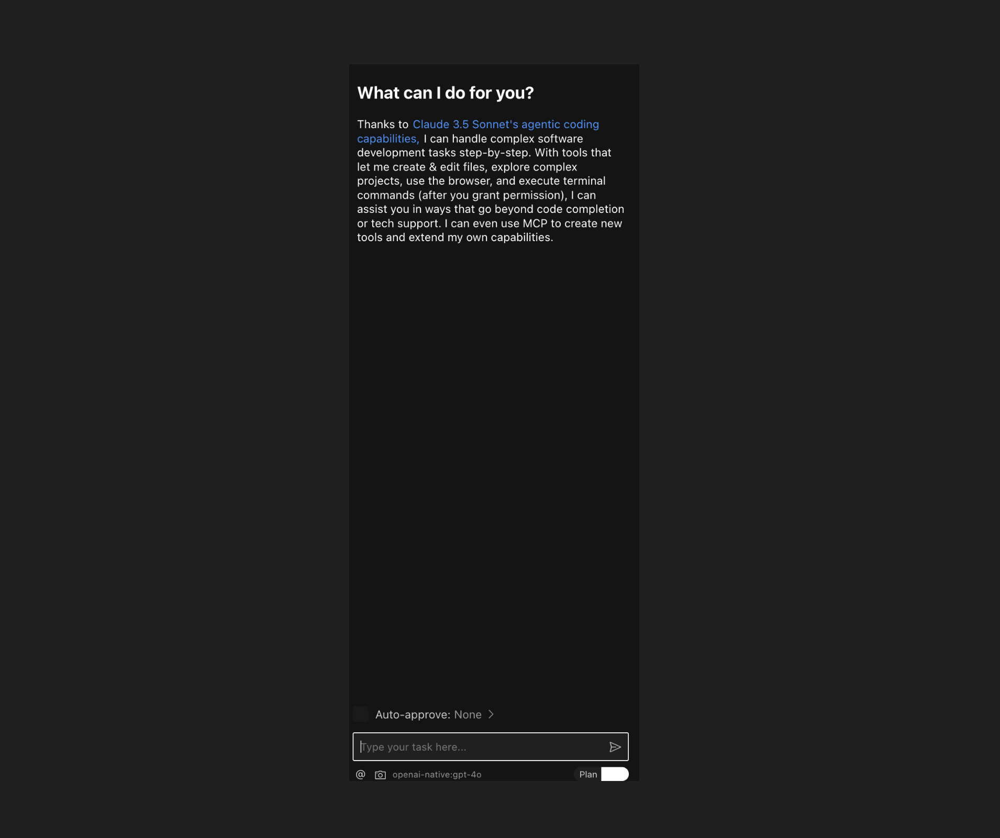
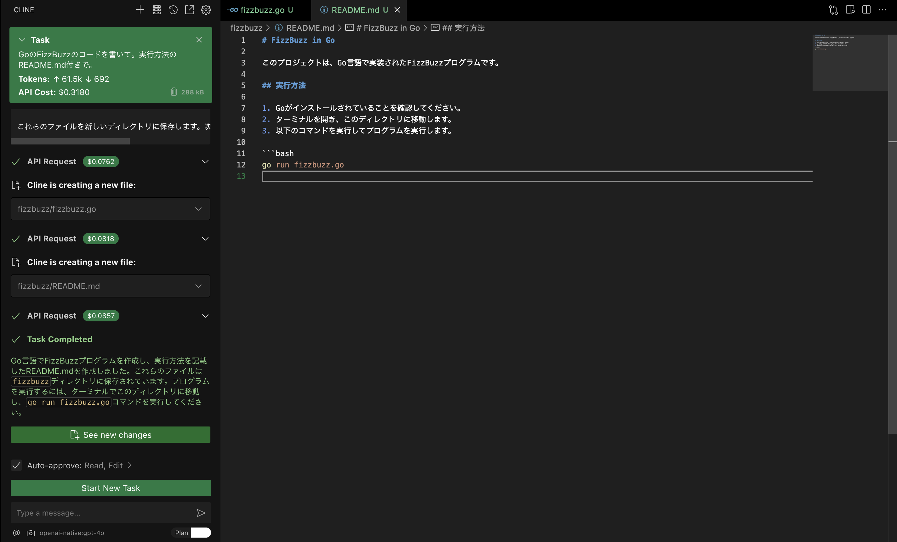
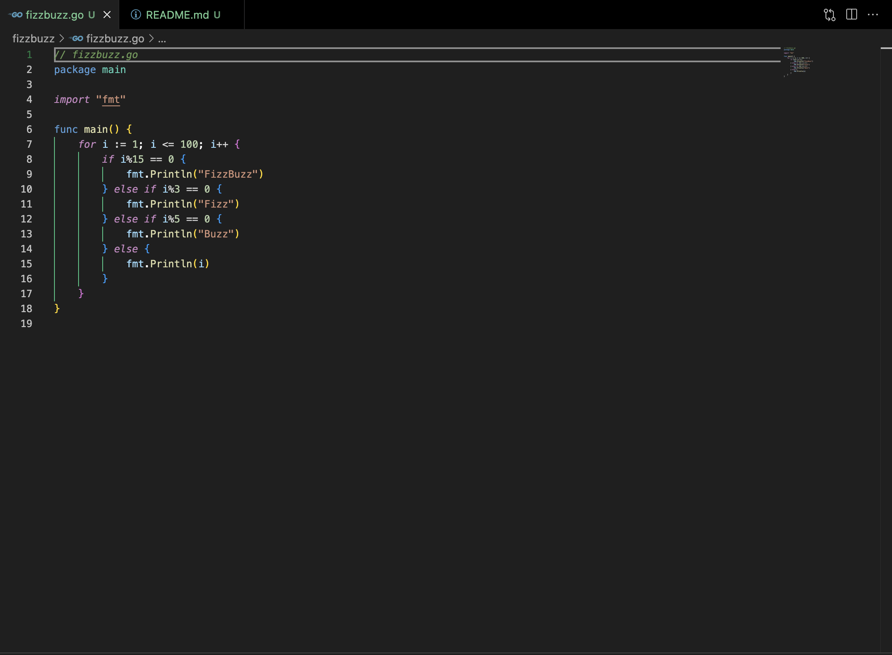
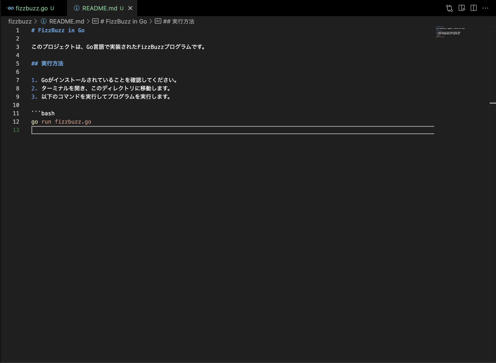
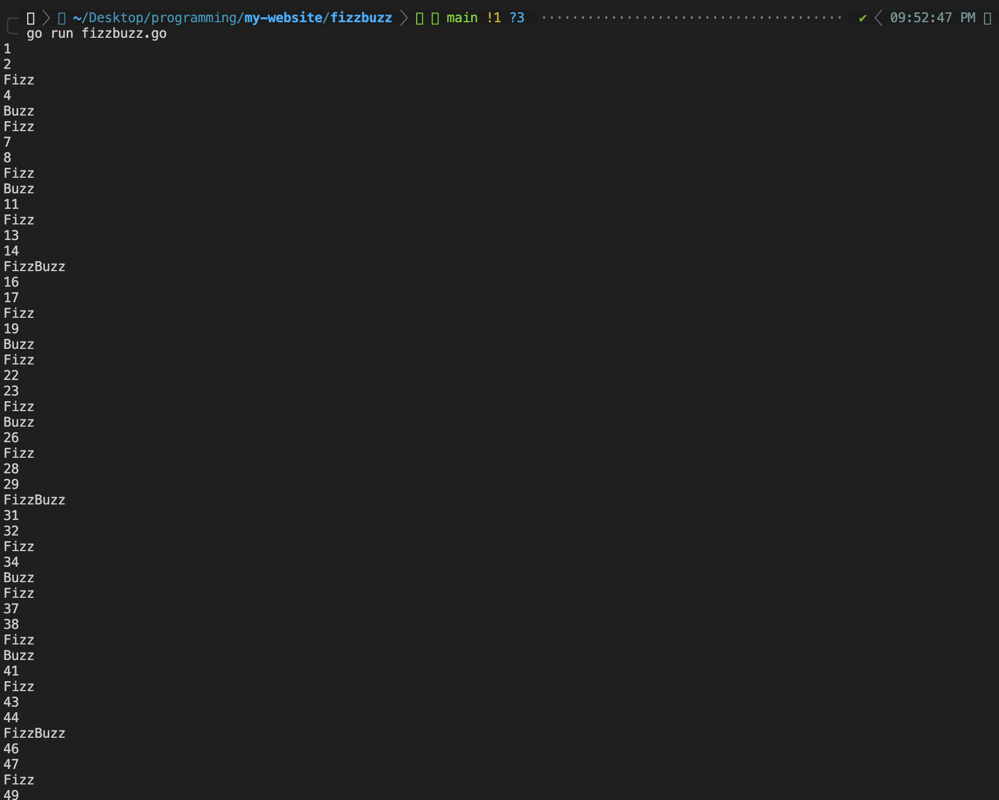
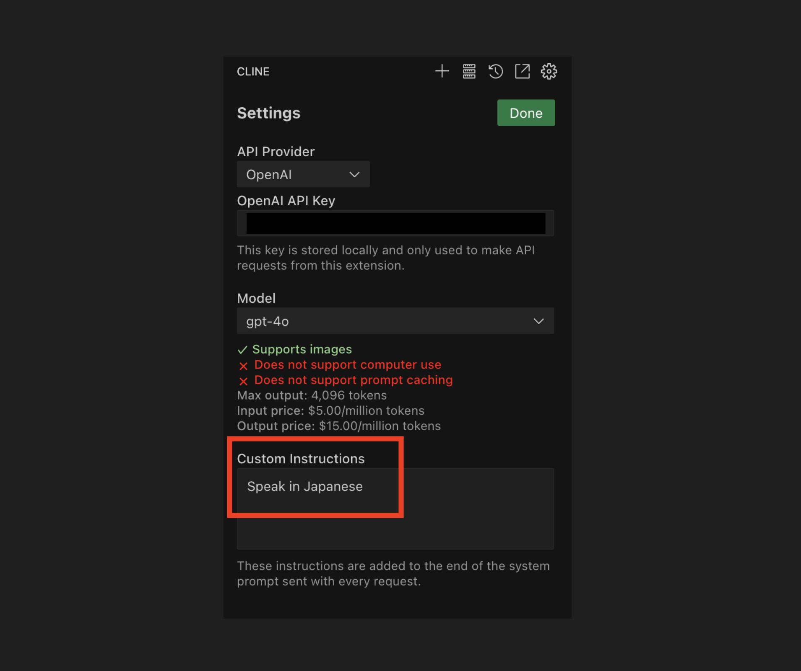

# Clineの使い方

## はじめに

VSCodeの拡張機能として使える、AIアシスタントの[Cline](https://github.com/cline/cline)を試してみました。使えるようにするまでのやり方を書いておきます。


## 使い方

### 拡張機能のインストール

VSCodeでClineの拡張機能をインストールします。



### ClineからLLMを使えるようにする

利用したいLLMプロバイダ（例: OpenAI, Anthropic）を選択し、対応するAPIキーを入力します。



APIキーを入力すると、プロンプト入力欄が表示され、指示を入力できるようになります。




### 指示をしてみる

今回は試しに簡単に以下のようなタスクを指示してみます。

```
GoのFizzBuzzのコードを書いて。実行方法のREADME.md付きで。
```

指示を実行すると、ClineがLLMへのAPIリクエストを駆使して、自動でファイルの作成などを行ってくれました。
また、1回あたりのAPIリクエストのコスト(金額)を表示してくれます。





生成されたファイルは以下の2つです。

`fizzbuzz/fizzbuzz.go`



`fizzbuzz/README.md`




実際に上記のGoのコードを実行してみると正しく動きました。




### 余談

設定画面からCustom Instructionsの設定ができます。Custom Instructionsを使うことで、Ground Ruleを柔軟に設定できます。今回の動作確認では、Clineの実行ログは日本語で出力されていましたが、これはあらかじめCustom Instructionsで指定していたからです。




## おわりに

最近注目されているツール「Cline」を試してみました。うまく使えば生産性は上がりそうな雰囲気がしたので、使いどころによっては積極的に使っていきたいですね。
