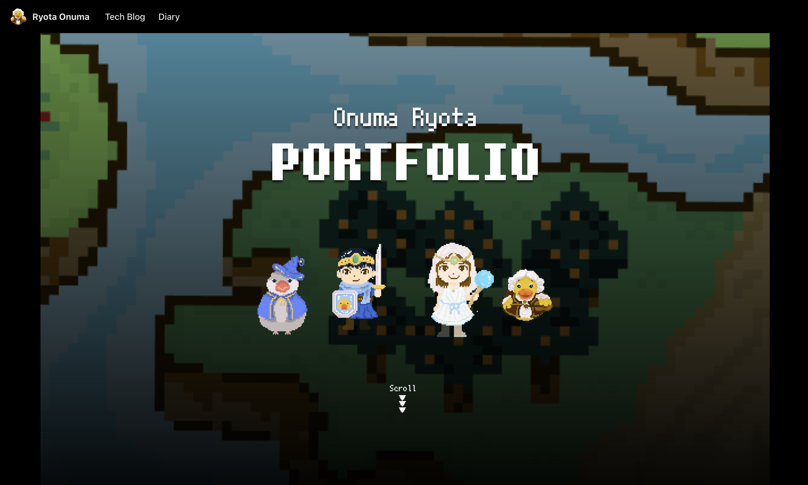

As a celebration of 2025, I rebuilt my new portfolio website with [Docusaurus](https://docusaurus.io/).

<!-- truncate -->

## About technology

I adopted [Docusaurus](https://docusaurus.io/). It is a framework which enables us to create OSS document websites easily. Thanks to its excellent functions, we can also use it for building personal websites.

The reasons why I chose Docusaurus are as follows:

- It provides easy support for multiple languages.
- Most features for supporting tech blogs are available when initializing a Docusaurus project.
- Markdown syntax is supported by default.
- Syntax highlighting is included as a standard feature.
- It offers a sophisticated default design.
- It's easy to create custom pages using React.

I have built similar portfolio sites using a variety of frameworks, including Hugo, Gatsby, SvelteKit, Next.js, and Nuxt.js. However, Docusaurus is the best way to do it for me. I found Docusaurus to be easiest to buid and maintain, requiring less effort to write CSS for responsive design.

I intend to use this site to contribute a variety of content in the future.
